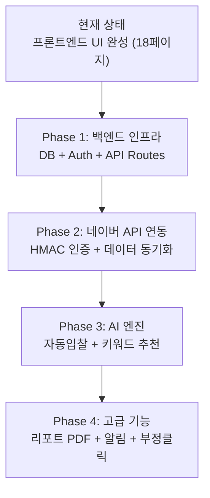

# 🔍 Agency OS & Naver Search Ad Project — 종합 감사 보고서

> **점검일**: 2026-03-12  
> **서버**: http://localhost:3000 (Next.js 16.1.6 Turbopack)

---

## 📸 주요 화면 스크린샷

````carousel

<!-- slide -->

<!-- slide -->

````

---

## 1. Agency OS — 전체 페이지 동작 현황

| # | 페이지 | URL | 렌더링 | 상호작용 | 비고 |
|:-:|--------|-----|:------:|:-------:|------|
| 1 | 🌐 루트 | `/` | ✅ | — | 대시보드로 리다이렉트 |
| 2 | 🌐 랜딩 | `/landing` | ✅ | ✅ | Hero, 기능 소개, CTA 정상 |
| 3 | 💰 가격 | `/pricing` | ✅ | ✅ | 월/연 토글 작동 |
| 4 | 🚀 데모 | `/demo` | ✅ | ✅ | 제품 투어 정상 |
| 5 | 🔮 ROI 계산기 | `/roi-calculator` | ✅ | ✅ | 슬라이더+실시간 차트 |
| 6 | 🔐 로그인 | `/login` | ✅ | ⚠️ | 폼 렌더링 OK, 실제 인증 미구현 |
| 7 | 🏠 대시보드 | `/dashboard` | ✅ | ✅ | KPI 카드, ROAS 차트, AI 추천 |
| 8 | 📊 캠페인 | `/dashboard/campaigns` | ✅ | ✅ | 계정 트리, ROAS 차트, 테이블 |
| 9 | 🔑 키워드 | `/dashboard/keywords` | ✅ | ✅ | 검색, 필터, 입찰 이력, 순위 탭, 부정클릭 탭 |
| 10 | 🤖 자동화 | `/dashboard/automation` | ✅ | ✅ | 컨펌 모드 토글, 6가지 입찰 전략 |
| 11 | 📋 리포트 | `/dashboard/reports` | ✅ | ✅ | 템플릿 카드, 발송 이력/자동 발송 탭 |
| 12 | 🏢 계정 관리 | `/dashboard/accounts` | ✅ | ✅ | 연동 계정 목록, API 키 상태 |
| 13 | 💰 수익성 | `/dashboard/profitability` | ✅ | ✅ | 고객별 마진, 적자 알림 |
| 14 | 🕵️ 경쟁 분석 | `/dashboard/competitive` | ✅ | ✅ | 경쟁사 비교, 시장 점유율 |
| 15 | 📈 시뮬레이터 | `/dashboard/simulator` | ✅ | ✅ | 예산/키워드 시뮬, 신뢰구간 |
| 16 | 🔔 알림 | `/dashboard/notifications` | ✅ | ✅ | 카테고리별 알림 리스트 |
| 17 | ⚙️ 설정 | `/dashboard/settings` | ✅ | ⚠️ | 5개 탭 구조, 폼 입력 OK, 저장 미동작 |
| 18 | 🛡️ 감사 로그 | `/dashboard/audit-log` | ✅ | ✅ | 사용자/AI 활동 이력 |

> **결론**: 18개 페이지 모두 정상 렌더링. 콘솔 에러 없음. **UI/프론트엔드는 거의 완성** 수준.

---

## 2. Agency OS — 추가 구현 필요 기능 리스트

### 🔴 Critical (백엔드 인프라 — 아직 전무)

| # | 기능 | 현재 상태 | PRD 섹션 |
|:-:|------|----------|---------|
| 1 | **백엔드 API 서버** (FastAPI/Next.js API Routes) | ❌ 미구현 | §8 Tech Stack |
| 2 | **데이터베이스** (PostgreSQL/Supabase) | ❌ 미구현 | §9 Data Model |
| 3 | **인증 시스템** (NextAuth.js + JWT) | ❌ 미구현 — 로그인 폼만 존재 | §10 Security |
| 4 | **네이버 검색광고 API 연동** (HMAC-SHA256) | ❌ 미구현 | §7.1 API 연동 |
| 5 | **Redis 캐시** | ❌ 미구현 | §8 Tech Stack |
| 6 | **스케줄러** (BullMQ/Celery) | ❌ 미구현 | §8 Tech Stack |

### 🟠 High (핵심 비즈니스 로직)

| # | 기능 | 현재 상태 | PRD 섹션 |
|:-:|------|----------|---------|
| 7 | **AI 자동 입찰 엔진** (5분 주기 봇) | ❌ 프론트 UI만 존재 | §7.1 자동입찰 |
| 8 | **AI 키워드 자동 추천/추가** | ❌ 추천 배너만 UI로 표시 | §7.1 키워드 |
| 9 | **실시간 데이터 동기화** (mock → 실제 API) | ❌ 모든 데이터가 하드코딩 | 전체 |
| 10 | **자동 컨펌 시스템 실제 동작** | ❌ 토글 UI만 존재 | §7.1 컨펌 |
| 11 | **벌크 수정 실제 저장** | ❌ UI만 존재 (API 호출 X) | §7.1 벌크 |
| 12 | **리포트 PDF 생성/발송** | ❌ 버튼 UI만 존재 | §7.1 리포트 |
| 13 | **설정/폼 데이터 저장** | ❌ 모든 폼 저장 미동작 | §8.1 설정 |
| 14 | **RBAC 권한 관리** (Owner/Admin/Viewer) | ❌ 미구현 | §10 Security |
| 15 | **결제 시스템** (토스페이먼츠/Stripe) | ❌ 미구현 | §12 Revenue |

### 🟡 Medium (PRD v1.0 Must Have 중 미구현)

| # | 기능 | 현재 상태 | PRD 섹션 |
|:-:|------|----------|---------|
| 16 | **대시보드 KPI '노출수', '전환수' 카드** | ⚠️ 총 광고비, ROAS, 키워드, 클릭만 표시 | §7.1 대시보드 |
| 17 | **대화형 AI 코파일럿** 인터페이스 | ❌ 미구현 | §7.1 Defensive AI |
| 18 | **부정클릭 방지 시스템** (8개 규칙 엔진) | ❌ 키워드 탭에 UI만 존재 | §7.1 부정클릭 |
| 19 | **순위 모니터링 실시간 갱신** (5분 주기) | ❌ 정적 mock 데이터 | §7.1 순위 |
| 20 | **CSV 임포트/익스포트 실제 동작** | ⚠️ 버튼 존재, 다운로드만 부분 동작 | §7.1 벌크 |
| 21 | **알림 채널 통합** (슬랙/카톡/이메일/웹훅) | ❌ 인앱 알림 UI만 존재 | §7.1 알림 |
| 22 | **경쟁사 전환 임포트 도구** | ❌ 미구현 | §7.4 전환 도구 |
| 23 | **API 키 만료 자동 감지/알림** | ❌ 정적 상태 표시만 | §7.1 API |
| 24 | **감사 로그 데이터베이스 연동** | ❌ 하드코딩 mock | §11.4 감사 |
| 25 | **모바일 반응형 레이아웃** | ⚠️ 부분적 — 하단 탭바 미구현 | §8.8 모바일 |
| 26 | **시뮬레이터 결과 PDF 영업 제안서 변환** | ❌ 미구현 | §7.1 시뮬레이터 |
| 27 | **시뮬레이션 이력 저장/비교** | ❌ 미구현 | §7.1 시뮬레이터 |

### 🟢 Low (Phase 2/v1.1 기능)

| # | 기능 | 현재 상태 | PRD 섹션 |
|:-:|------|----------|---------|
| 28 | AI 소재 추천 & A/B 테스트 | ❌ | §7.2 |
| 29 | 예산 자동 배분 | ❌ | §7.2 |
| 30 | 이상 감지 알림 (CPC 급등 등) | ❌ | §7.2 |
| 31 | 경쟁사 소재 변경 자동 추적 | ❌ | §7.2 |
| 32 | 수익성 정산 대시보드 연동 | ❌ | §7.2 |
| 33 | 고객 이탈 예측 AI | ❌ | §7.3 |
| 34 | 멀티 플랫폼 통합 (구글/카카오) | ❌ | §7.3 |
| 35 | 자연어 AI 지시 (채팅 인터페이스) | ❌ | §7.3 |

---

## 3. Naver Search Ad Project (PRD 저장소) — 미구현 콘텐츠 리스트

> `naver_search_ad_project-master`는 **코드 프로젝트가 아닌 PRD/문서 저장소**입니다.  
> Agency OS 구현 시 참조해야 하지만 아직 반영되지 않은 핵심 사항들:

| # | 문서 | 핵심 미반영 내용 |
|:-:|------|----------------|
| 1 | [06_feature_specification.md](file:///Users/yoojunghoon/Downloads/code/naver_search_ad_project-master/agency_os_prd_v3.2/06_feature_specification.md) | **커스텀 위젯** 기반 대시보드 (스파크라인, 게이지 차트 등), **대화형 AI 코파일럿** 7대 시나리오 전원 미구현 |
| 2 | [08_tech_stack.md](file:///Users/yoojunghoon/Downloads/code/naver_search_ad_project-master/agency_os_prd_v3.2/08_tech_stack.md) | FastAPI 백엔드, Supabase DB, Redis, BullMQ 스케줄러 등 **백엔드 전체 미구현** |
| 3 | [09_data_model.md](file:///Users/yoojunghoon/Downloads/code/naver_search_ad_project-master/agency_os_prd_v3.2/09_data_model.md) | Drizzle 스키마 정의됨 (`drizzle_schema.ts`) but **실제 DB 미연결** |
| 4 | [10_security.md](file:///Users/yoojunghoon/Downloads/code/naver_search_ad_project-master/agency_os_prd_v3.2/10_security.md) | AES-256 API 키 암호화, JWT 인증, RBAC **전원 미구현** |
| 5 | [16_api_rate_limit_simulation.md](file:///Users/yoojunghoon/Downloads/code/naver_search_ad_project-master/agency_os_prd_v3.2/16_api_rate_limit_simulation.md) | API Rate Limit 시뮬레이션 (30계정 동시 관리 시 레이트 제한 회피 전략) **미구현** |
| 6 | [17_click_fraud_prevention.md](file:///Users/yoojunghoon/Downloads/code/naver_search_ad_project-master/agency_os_prd_v3.2/17_click_fraud_prevention.md) | 4계층 부정클릭 방지 아키텍처, 8개 탐지 규칙, ML 파이프라인 **전원 미구현** |
| 7 | [18_test_strategy.md](file:///Users/yoojunghoon/Downloads/code/naver_search_ad_project-master/agency_os_prd_v3.2/18_test_strategy.md) | E2E/통합/단위 테스트 전략 **미구현** (테스트 코드 0개) |
| 8 | [naver_search_ad_prd.md](file:///Users/yoojunghoon/Downloads/code/naver_search_ad_project-master/naver_search_ad_prd.md) | 원본 PRD의 네이버 검색광고 API 상세 연동 스펙 (HMAC-SHA256 인증, 각 엔드포인트별 구현) |
| 9 | [drizzle_schema.ts](file:///Users/yoojunghoon/Downloads/code/naver_search_ad_project-master/agency_os_schema/drizzle_schema.ts) | 36KB 규모의 상세 DB 스키마가 이미 설계 완료, **프로젝트에 미적용** |

---

## 4. 요약 & 우선순위 권장사항



| 우선순위 | 기능 그룹 | 예상 규모 | 비고 |
|:-------:|----------|:--------:|------|
| 🔴 P0 | DB + 인증 + API 기반 | 대규모 | Supabase/Drizzle 스키마 활용 가능 |
| 🔴 P0 | 네이버 검색광고 API 연동 | 대규모 | HMAC-SHA256 서명, 30계정 동시 |
| 🟠 P1 | AI 자동입찰 엔진 | 중규모 | 5분 주기 스케줄러 + 안전장치 |
| 🟠 P1 | 데이터 CRUD 실 연결 | 중규모 | 모든 폼/테이블 → API 호출 |
| 🟡 P2 | 리포트 PDF 생성/발송 | 소규모 | puppeteer/react-pdf |
| 🟡 P2 | 알림 채널 통합 | 소규모 | 슬랙/카톡/이메일 웹훅 |
| 🟢 P3 | AI 코파일럿 | 중규모 | LLM Function Calling |
| 🟢 P3 | 부정클릭 방지 | 대규모 | 4계층 아키텍처 |

> [!IMPORTANT]
> 현재 Agency OS는 **프론트엔드 데모 수준**입니다. 모든 데이터가 하드코딩이며, 백엔드/DB/API 연동이 전무합니다. 프로덕션으로 전환하려면 위 P0 항목들이 반드시 선행되어야 합니다.
