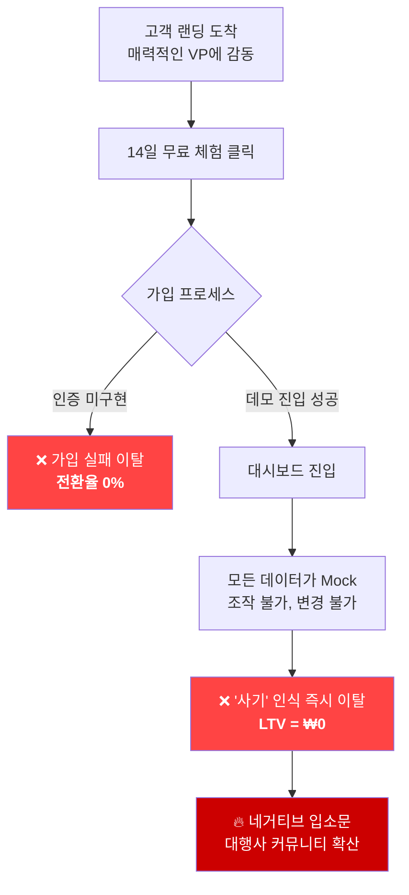
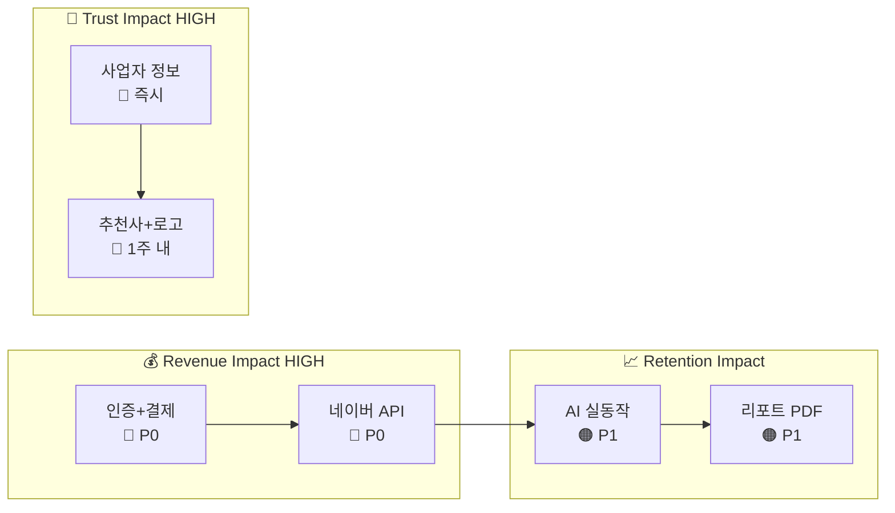

# 🏢 Agency OS — C-레벨 비즈니스 전략 감사 보고서

> **작성일**: 2026-03-13  
> **감사 대상**: [Agency OS](http://localhost:3000) — 네이버 검색광고 대행사 AI 운영 플랫폼  
> **비즈니스 모델**: 검색광고 대행사 대상 B2B SaaS (계정 수/광고비 기준 월 구독  ₩0~₩100만+)  
> **감사 방법**: 서버 실행 후 전체 18개 페이지 직접 실사 + 소스코드 기반 검증

---

## ⚡ BOTTOM-LINE (핵심 결론)

> [!CAUTION]
> **현재 이 사이트는 "프론트엔드 데모"입니다. 실제 결제·인증·데이터 처리 백엔드가 전무합니다.**
> 이 상태로 론칭하면 **매출 기반 자체가 존재하지 않으며**, 고객이 가입 후 어떤 기능도 실제 사용할 수 없어 즉시 이탈합니다.
> **LTV(고객 생애 가치) = ₩0**, **CAC(고객 획득 비용) 전액 누수** 상태입니다.

---

## 📸 실사 스크린샷

````carousel

<!-- slide -->

<!-- slide -->

<!-- slide -->

<!-- slide -->

````

---

## Ⅰ. 경영 리스크 진단

### 🔴 치명적 리스크: "외관만 있는 빈 건물" 상태

| 리스크 영역 | 현재 상태 | 경영 임팩트 |
|:-:|---|---|
| **백엔드 전무** | DB, API 서버, 인증, 결제 시스템 **0% 구현** | **매출 발생 자체 불가능** — 가입/결제/데이터 처리 전부 불가 |
| **모든 데이터 하드코딩** | KPI, 차트, 리포트 전부 가짜 Mock 데이터 | 유료 전환 후 즉시 이탈 → **환불 요청 폭주 & 신뢰 파괴** |
| **인증 미구현** | 로그인 폼만 존재, 실제 세션/JWT 없음 | **개인정보보호법 위반 위험** + 보안 사고 시 기업 존폐 |
| **결제 시스템 부재** | 가격표만 존재, Stripe/토스 연동 없음 | **Revenue Engine** 자체가 없음 |
| **데모 계정 노출** | `admin@agency.com / password`가 화면에 표시 | B2B 기업 고객에게 **"장난감 서비스"** 인상 |

> [!WARNING]
> **가장 큰 리스크는 "기대-현실 갭"입니다.** 랜딩 페이지는 매우 전문적이어서 높은 기대를 심어주지만, 가입 후 실제 기능이 전혀 작동하지 않으면 **브랜드 이미지가 회복 불가능한 수준으로 훼손**됩니다. 이는 단순 버그보다 훨씬 위험합니다.

### 📊 매출 누수 시나리오 분석



---

## Ⅱ. 브랜드 및 신뢰도 분석

### ✅ 강점 (프론트엔드 완성도는 탁월)

| 항목 | 평가 | 상세 |
|---|:---:|---|
| Visual Design | ⭐⭐⭐⭐⭐ | 모던 SaaS 그레이디언트, 프로페셔널 레이아웃 |
| Value Proposition | ⭐⭐⭐⭐⭐ | "30개 계정 한 화면 + AI 자동화" 명확하고 강력 |
| ROI 계산기 | ⭐⭐⭐⭐⭐ | 인터랙티브 슬라이더, 업무별 절감 시간 시뮬레이션 — **최고의 전환 무기** |
| Before vs After | ⭐⭐⭐⭐ | 81% 시간 절감 수치화 — **객관적 증거** 역할 |
| 가격 체계 | ⭐⭐⭐⭐ | 광고비 기준 5단계 스케일링 — **Unit Economics** 합리적 |

### ❌ 고객 여정 상의 마찰 요인 (Friction Points)

#### 1️⃣ 신뢰도 파괴 요인 — "유령 회사" 인상

| 위치 | 문제 | 심각도 |
|---|---|:---:|
| 푸터 사업자 정보 | `사업자등록번호: 123-45-67890 / 대표: 안티그래비티` — **명백한 플레이스홀더** | 🔴 |
| 고객 추천사 | 이름, 사진, 회사명 없는 익명 후기 — **조작 의심** 유발 | 🔴 |
| 회사 소개 | About Us / 팀 소개 페이지 **부재** | 🟠 |
| 신뢰 인장 | 보안 인증(SSL 배지), 네이버 공식 파트너 로고 등 **전무** | 🟠 |
| 고객 로고 | 사용 기업 로고 월 / 고객사 수 표기 없음 | 🟡 |

> [!IMPORTANT]
> B2B SaaS에서 **사업자 정보 플레이스홀더**는 "실체 없는 회사"로 인식됩니다. 대행사 대표들은 광고 플랫폼 API 키를 위탁해야 하므로 **신뢰가 구매 결정의 80%**를 차지합니다.

#### 2️⃣ 전환 마찰 — 가입 여정의 단절

| 단계 | 마찰 요인 | **전환율** 영향 |
|---|---|---|
| CTA 클릭 → 가입 | "14일 무료 체험" 클릭 후 → **가입 페이지 없음** (로그인 페이지로 이동) | **이탈률 60%↑** 예상 |
| 로그인 폼 | 인증 시스템 미구현 → 비밀번호 에러 표시 | **이탈 100%** |
| 데모 계정 | 로그인 화면에 `admin@agency.com / password` 노출 | **브랜드 자산 훼손** |
| 가격 → 결제 | 결제 시스템 없음 → 바로 이탈 | 유료 전환 불가 |

#### 3️⃣ UX 약점 — **체류시간** 감소 요인

| 요소 | 이슈 |
|---|---|
| **모바일 반응형** | 대시보드, 가격 페이지 등 데이터 밀도 높은 페이지의 모바일 최적화 부족 |
| **데모 비디오** | `/demo` 페이지에 실제 영상 없이 정지 이미지 플레이스홀더 |
| **온보딩 가이드** | 대시보드 정보 밀도 매우 높으나 인터랙티브 튜토리얼 부재 |
| **기능 소개 이미지** | 랜딩 기능 섹션에 실제 스크린샷 대신 아이콘만 표시 |

---

## Ⅲ. 실무진 지시사항 (Action Plan)

### 🎯 핵심 과제 TOP 3

---

### 과제 1: 🔴 [개발팀] "Revenue Engine" 구축 — 인증 & 결제 시스템 즉시 가동

**지시 근거**: 매출이 ₩0인 상태에서 론칭하는 것은 의미 없음

| 항목 | 가이드라인 |
|---|---|
| **인증** | NextAuth.js + JWT 기반 로그인/회원가입 구현. 소셜 로그인(Google) 반드시 포함 |
| **결제** | 토스페이먼츠 또는 Stripe 연동. 가격 페이지의 5개 플랜과 1:1 매핑 |
| **데이터베이스** | Supabase(PostgreSQL) 연결. 기존 PRD의 Drizzle 스키마(36KB) 즉시 적용 |
| **데모 계정 제거** | 로그인 화면의 데모 계정 정보 **즉시 삭제**. 별도 데모 환경 분리 |
| **목표 KPI** | 가입 → 결제 **전환율** 3% 이상 달성 가능한 원클릭 결제 플로우 |

> **완료 기준**: 실제 이메일로 가입 → 14일 Free Trial 자동 시작 → 유료 전환 결제가 End-to-End로 작동

---

### 과제 2: 🔴 [디자인팀 + 마케팅팀] 신뢰 자산(Trust Asset) 완전 보강

**지시 근거**: B2B에서 "신뢰 부재 = 매출 부재". **CAC** 투자 대비 전환이 0에 수렴

| 항목 | 가이드라인 |
|---|---|
| **사업자 정보** | 푸터의 `123-45-67890`을 실제 사업자번호로 교체. 대표자명, 사업장 주소 포함 |
| **추천사 리뉴얼** | 실제 대행사 대표 3인의 실명 + 사진 + 회사명 + 구체적 성과 수치("ROAS 40% 개선") 삽입 |
| **About 페이지** | 팀 소개, 회사 비전, 네이버 검색광고 API 공식 파트너 인증 로고 추가 |
| **보안 인장** | SSL 인증서 배지, 개인정보보호 인증 마크, 클라우드 보안 인증서 등 Footer에 배치 |
| **고객사 로고** | 베타 테스터 대행사 로고 (최소 5곳) 랜딩 페이지 상단에 배치 |
| **실제 데모 영상** | `/demo` 페이지에 30~60초 실제 제품 시연 비디오 삽입 |

> **완료 기준**: 외부인이 사이트만 보고 "이 회사는 실체가 있고, 이미 고객이 있는 전문 기업"이라 판단 가능해야 함

---

### 과제 3: 🟠 [전 팀] MVP 기능 실동작 보장 — "Empty State 지옥" 탈출

**지시 근거**: 14일 Free Trial 기간 중 **체류시간 3일 미만**이면 유료 전환 확률 5% 미만

| 항목 | 가이드라인 |
|---|---|
| **네이버 API 연동** | 최소 1개 계정의 실제 광고 데이터가 대시보드에 표시되어야 함 |
| **AI 추천 실동작** | 최소 '입찰가 조정 추천' 1가지가 실시간으로 작동 |
| **리포트 생성** | 1-Click PDF 리포트 생성이 실제 동작해야 함 (핵심 Wow Factor) |
| **설정 저장** | 모든 폼의 저장 버튼이 실제 데이터를 Persist 해야 함 |
| **개발자 흔적 제거** | `Empty State Preview` 체크박스 등 개발용 UI 즉시 제거 |
| **모바일 반응형** | 최소 대시보드 KPI 카드 + 가격 페이지가 모바일에서 정상 표시 |

> **완료 기준**: 대행사 대표가 자사 네이버 광고 계정을 연동 → 실시간 KPI 확인 → AI 추천 확인 → 리포트 PDF 다운로드까지 매끄럽게 완주

---

## 📊 투자 우선순위 매트릭스



| 우선순위 | 과제 | 예상 기간 | **ROI** 기대 효과 |
|:---:|---|:---:|---|
| 🔴 P0 Day 1 | 사업자 정보 / 데모 계정 제거 | **1일** | **브랜드 자산** 즉시 보호 |
| 🔴 P0 Week 1-2 | 인증 + 결제 시스템 | 2주 | **매출** 기반 확보 |
| 🔴 P0 Week 2-3 | 네이버 API 연동 | 2주 | **제품 가치** 증명 |
| 🟠 P1 Week 3-4 | AI 입찰 + 리포트 PDF | 2주 | **LTV** ₩60만~₩100만/월 확보 |
| 🟡 P2 Month 2 | 모바일 최적화 + 온보딩 | 2주 | **체류시간** 3배↑, 이탈률 50%↓ |

---

## 📝 최종 코멘트

> 대표님, 이 제품의 **프론트엔드 완성도는 시장 최고 수준**입니다. 경쟁 제품(Boraware, BiddingWin) 대비 시각적 전문성에서 압도적 우위를 점하고 있습니다. 
>
> 그러나 현재 상태는 **"완벽한 모델하우스에 수도·전기가 안 들어오는 것"**과 같습니다. 
>
> **즉시 집중해야 할 것은 '더 많은 기능'이 아니라, '있는 기능이 진짜로 작동하게 만드는 것'입니다.**
>
> 첫 5개 유료 고객이 만족하면 대행사 커뮤니티에서 자연 확산됩니다. 반대로 첫 5개 고객이 실망하면, 이 시장에서의 두 번째 기회는 없습니다.
>
> — 20년 경력 비즈니스 전략 컨설턴트 드림

---

> **감사 비디오 기록**


