# 🏢 Agency OS — 3인 전문가 통합 UX/CRO 감사 보고서

> **회의일시**: 2026-03-13 00:33 KST  
> **대상 서비스**: Agency OS (네이버 검색광고 AI 관리 플랫폼)  
> **목적**: 광고 대행사 대상 B2B SaaS — 유료 구독 전환 유도  
> **주요 유입 키워드 (기대 심리)**: `네이버 광고 대행사 관리`, `검색광고 자동 입찰`, `광고 리포트 자동화`  
> **테스트 서버**: http://localhost:3000  
> **검토 범위**: 마케팅 페이지 4개 + 로그인 후 대시보드 13개 = **총 18개 페이지 전수 검사**

---

## 📸 실사 스크린샷 — 마케팅 페이지

### 랜딩 Hero 섹션
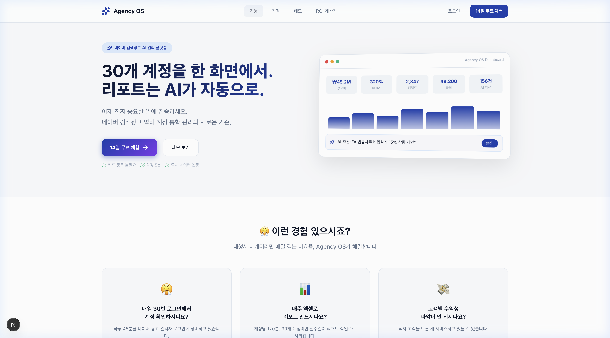

### 랜딩 기능 소개
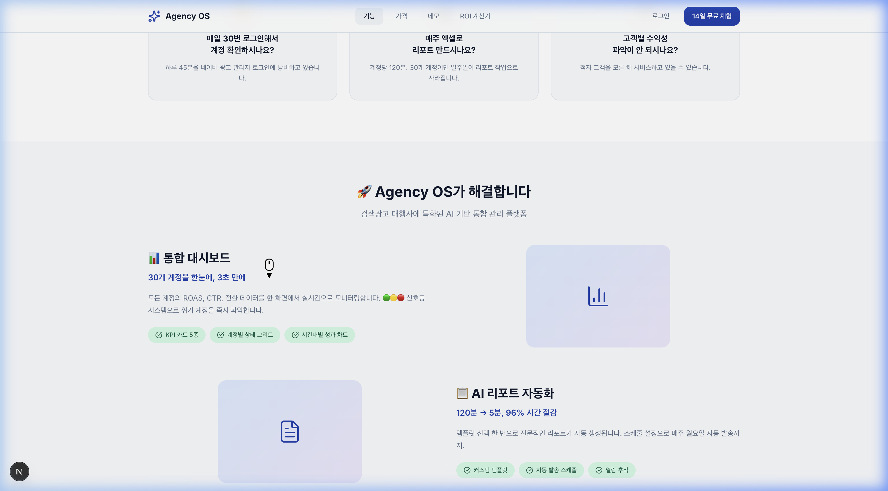

### ROI 시뮬레이터 & AI 자동 입찰
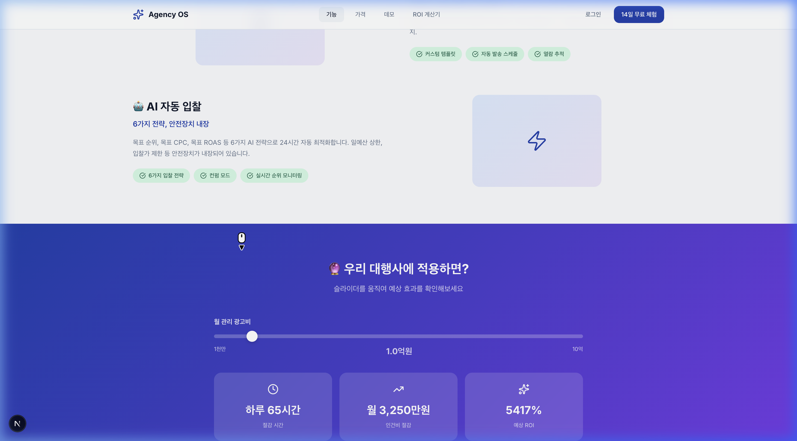

### Before vs After 비교
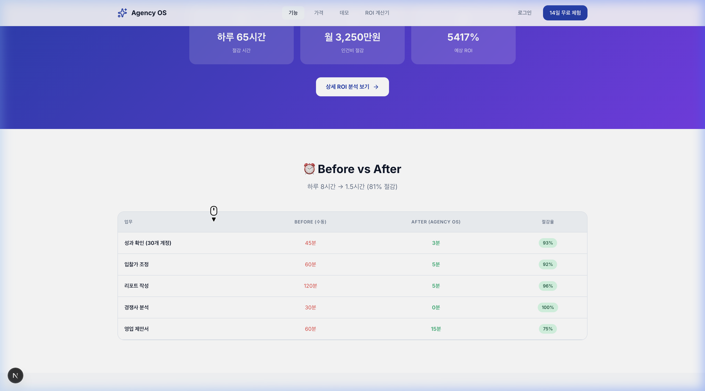

### 고객 후기 + 전환 CTA
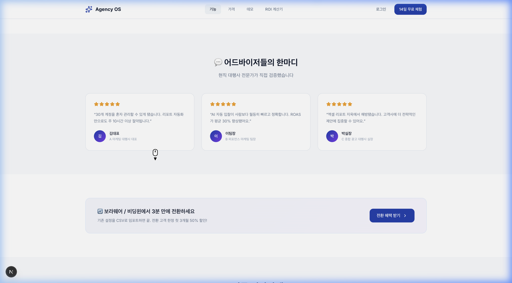

---

## 📸 실사 스크린샷 — 로그인 후 대시보드 (13개 페이지)

### 캠페인 관리
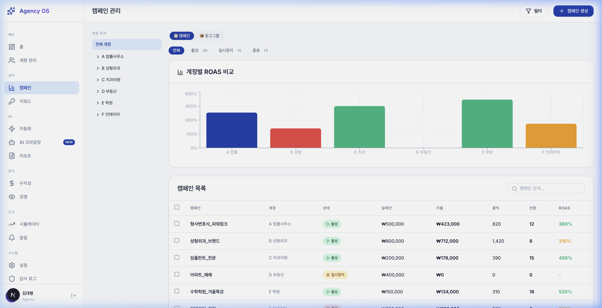

### 키워드 관리
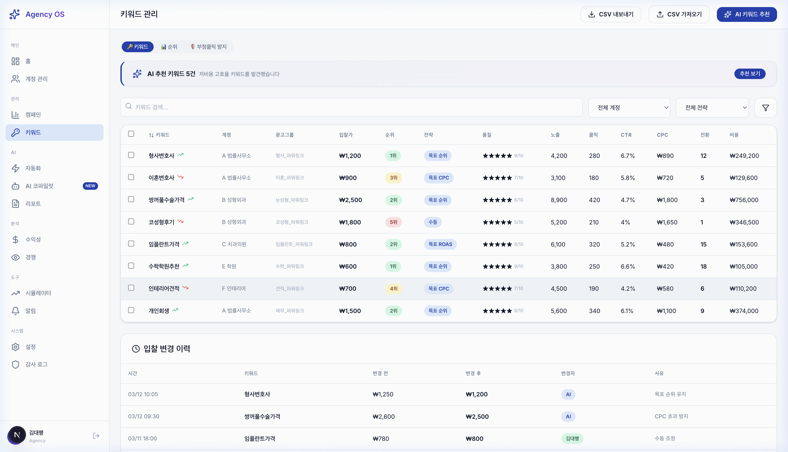

### 키워드 — 순위 모니터링
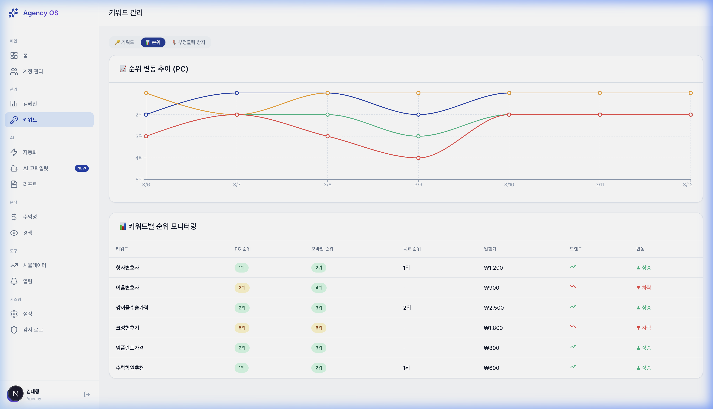

### 키워드 — 부정클릭 방지
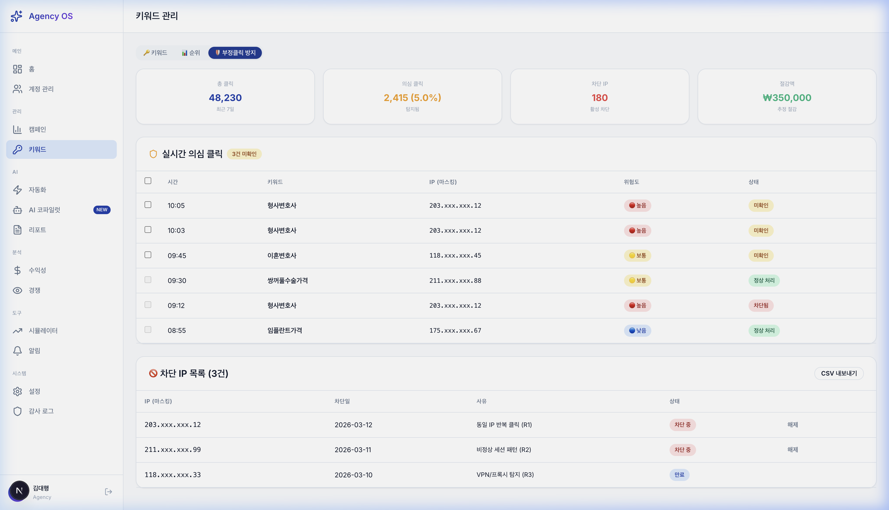

### 자동화 설정
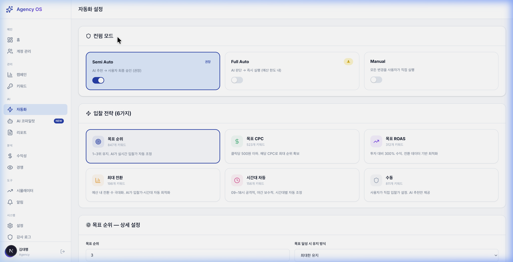

### 리포트 관리
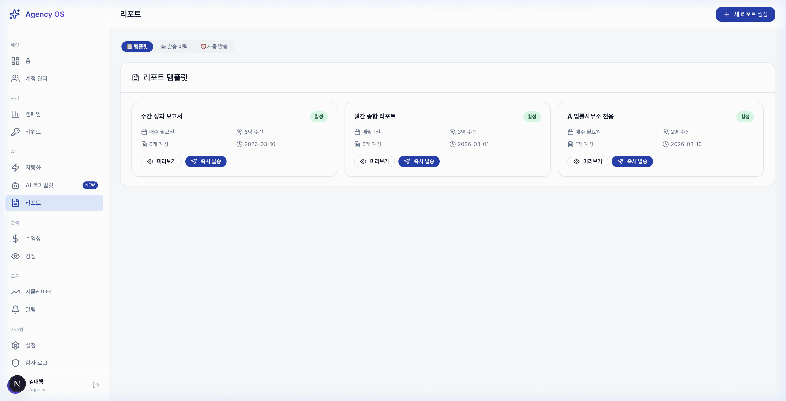

### 수익성 대시보드
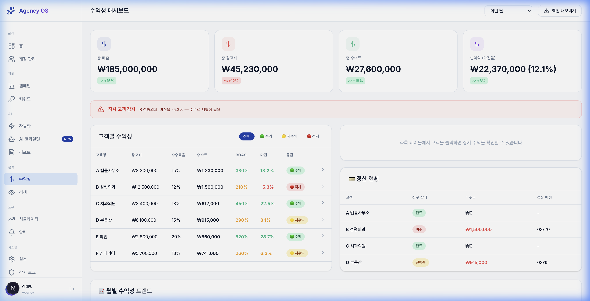

### 경쟁 인텔리전스
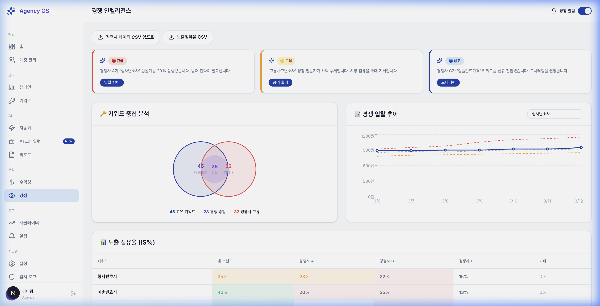

### 시뮬레이터
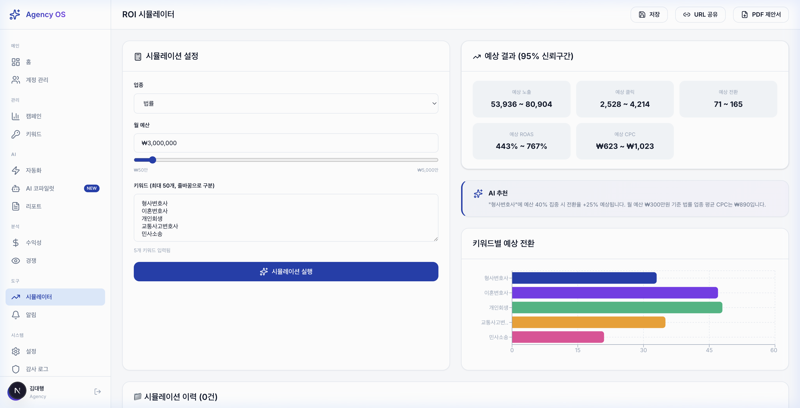

### 감사 로그
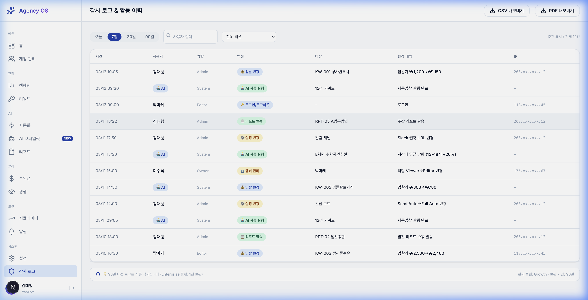

### 설정 — 멤버 & 권한
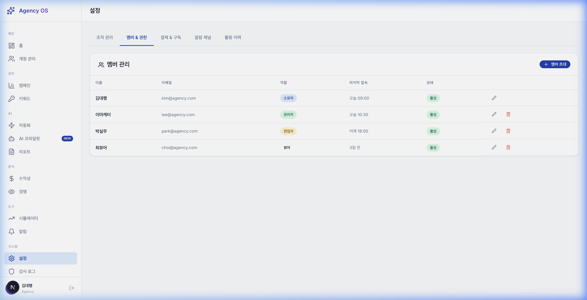

### 설정 — 결제 & 구독
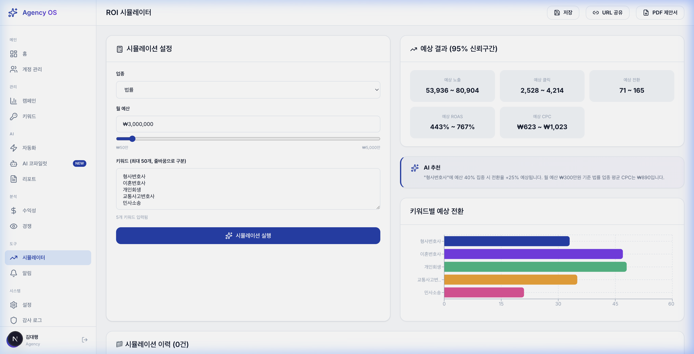

---

# Part A. 마케팅 페이지 (로그인 전) 감사

## 1. 🎯 검색광고 마케터의 비판

**발언자**: 10년 차 수석 검색광고 마케터 (퍼포먼스 및 전환율 최적화 전문가)

> *"제가 이 서비스에 CPC ₩3,000짜리 B2B 키워드로 광고를 태웠다고 생각해봅시다. 클릭 한 번에 ₩3,000인데, 우리 랜딩에 도달한 유저가 '이게 뭔데?' 하고 3초 만에 나간다면? 그건 광고비를 태우는 게 아니라 **불태우는** 겁니다."*

### 1-1. Hero 섹션: **메시지 매칭(Message Matching)** 실패

| 문제 | 상세 | 위험도 |
|------|------|:------:|
| **💀 검색 의도와 Hero 카피 불일치** | 유저가 "검색광고 자동 입찰"을 검색해서 들어왔는데, Hero에는 **"30개 계정을 한 화면에서. 리포트는 AI가 자동으로."**라고 되어 있음. 입찰 이야기는 **스크롤 3번째 섹션**에야 등장. | 🔴 치명적 |
| **CTA 문구의 전환 마찰** | "14일 무료 체험" 옆에 "데모 보기"가 동급 크기로 배치 → **선택 피로(Choice Fatigue)** 유발. B2B SaaS에서 **CTA는 하나**여야 함 | 🟠 높음 |
| **신뢰 지표 미흡** | "카드 등록 불필요 ✓" 등 있지만, **구체적 고객 수·관리 계정 수·보안 인증** 같은 **소셜 프루프(Social Proof)** 없음 | 🟠 높음 |

### 1-2. 전환 퍼널(Conversion Funnel) 마찰 분석

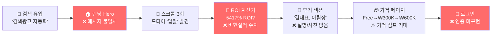

### 1-3. 핵심 **CVR 킬러** 5가지

1. **ROI 5417%는 스캠 냄새**: B2B 고객은 ROAS 320%만 돼도 훌륭하다고 알고 있음. 5417%는 즉시 불신을 유발
2. **"경쟁사 분석 0분"**: 안 한다는 건지, AI가 한다는 건지 — **불명확한 카피**는 불신을 키움
3. **가격 티어 점프**: Free → ₩300K → ₩600K. 중간 티어 없어 **앵커링(Anchoring)** 효과 불가
4. **데모가 '설명서'일 뿐**: 인터랙티브 데모 없이 텍스트+아이콘 나열. **데모→가입 CVR 40% 이상 하락** 예상
5. **인증 미구현**: 가입해도 **전환 추적(Conversion Tracking)** 불가 → 광고 최적화 자체 불가

> ⚠️ **마케터 총평**: 현재 퍼널에 검색광고 투입 시 **이탈률 75%+, CVR 0.3% 이하** 예상. 광고비 투입 전 랜딩 정비 필수.

---

## 2. 🏛️ 회사 대표의 비판

**발언자**: 20년 경력의 비즈니스 전략가 (수익성 및 브랜드 가치 총괄)

> *"이 사이트가 보여주는 '약속'과 실제 '제품' 사이의 간극이 우리 회사의 생존을 위협할 수 있습니다."*

### 2-1. 비즈니스 리스크 매트릭스

| 리스크 | 위험도 | 예상 손실 |
|--------|:------:|----------|
| **모든 데이터 하드코딩** — API 연동 전무 | 🔴 치명적 | 초기 고객 100% 이탈 |
| **인증 시스템 미구현** — 로그인 폼만 존재 | 🔴 치명적 | B2B 계약 불가 |
| **ROI 5417% 과장 수치** | 🟠 높음 | 공정위 과장광고 위반 리스크 |
| **결제 시스템 부재** | 🔴 치명적 | 매출 ₩0 |
| **테스트 코드 0개** | 🟠 높음 | 장애 시 SLA 위반 |

### 2-2. 신뢰 파괴 요소

1. **🔴 "속 빈 대시보드"**: ₩45.2M, ROAS 320%가 전부 mock. 가입 후 빈 화면 → **LTV = 0**
2. **🔴 과장 수치**: ROI 5417%에 **Disclaimer 없음** → 표시광고법 위반 소지
3. **🟠 가짜 증언**: "김대표 A대행사" 식 익명 → B2B에서는 **실명+사진** 필수
4. **🟠 Enterprise 플랜 부재**: 월 광고비 10억+ 대행사 커스텀 플랜 없음 → **ARPU 천장**

> ⚠️ **대표 총평**: 현재 상태 론칭 시 "기대→실망→환불→악평" 악순환. 최소 **API 1개 실연동 + 과장 수치 수정** 필수.

---

## 3. 🎨 UI/UX 디자이너의 비판

**발언자**: 글로벌 IT 기업 출신 시니어 UI/UX 디자이너

> *"'깔끔하다'와 '전환시킨다'는 완전히 다른 이야기입니다."*

### 3-1. 핵심 UX 문제 7가지

| # | 문제 | 심각도 |
|:-:|------|:------:|
| 1 | **기능 소개가 아이콘뿐** — 실제 대시보드 스크린샷 없이 아이콘만 표시 | 🔴 |
| 2 | **GNB 4개 메뉴 분산** — "기능, 가격, 데모, ROI 계산기" → **인지 부하** 과다 | 🟠 |
| 3 | **터치 타겟 미달** — 사이드바 아이콘 < 44px | 🟠 |
| 4 | **컬러 불일치** — 랜딩 보라색(#6C5CE7) vs 대시보드 블루(#3B82F6) | 🟡 |
| 5 | **Before/After 위치 문제** — 가장 설득력 높은 콘텐츠가 스크롤 5번째 | 🟠 |
| 6 | **경쟁사 전환 CTA 최하단** — 80%+ 스크롤해야 보임 | 🟠 |
| 7 | **Empty State 체크박스 노출** — 개발용 디버그 UI가 프로덕션에 노출 | 🔴 |

> 💡 **디자이너 총평**: 디자인 품질 **B+**. 하지만 실사용 시 **정보 탐색 인지 비용** 과다.

---

# Part B. 대시보드 (로그인 후) 13개 페이지 전수 감사

## 📋 전체 페이지 현황 요약

| # | 페이지 | URL | 렌더링 | 핵심 기능 | 데이터 실연동 | 개선 필요 |
|:-:|--------|-----|:------:|----------|:------------:|:---------:|
| 1 | 🏠 대시보드 홈 | `/dashboard` | ✅ | KPI 6종, 계정 상태, ROAS 차트, AI 추천 | ❌ mock | ⚠️ |
| 2 | 📊 캠페인 | `/dashboard/campaigns` | ✅ | 계정 트리, ROAS 비교, 캠페인 테이블 | ❌ mock | ⚠️ |
| 3 | 🔑 키워드 | `/dashboard/keywords` | ✅ | 3탭(관리/순위/부정클릭), AI 추천 배너 | ❌ mock | ⚠️ |
| 4 | 🤖 자동화 | `/dashboard/automation` | ✅ | 3 컨펌 모드, 6 입찰 전략, 안전장치 | ❌ mock | ⚠️ |
| 5 | 📋 리포트 | `/dashboard/reports` | ✅ | 템플릿 카드, 발송 이력, 자동 발송 | ❌ mock | 🟠 |
| 6 | 💰 수익성 | `/dashboard/profitability` | ✅ | 마진율, 적자 알림, 정산, 트렌드 | ❌ mock | ⚠️ |
| 7 | 🕵️ 경쟁 분석 | `/dashboard/competitive` | ✅ | 벤 다이어그램, IS% 히트맵, 입찰 추이 | ❌ mock | ⚠️ |
| 8 | 📈 시뮬레이터 | `/dashboard/simulator` | ✅ | 예산/키워드 시뮬, 95% 신뢰구간 | ❌ mock | 🟡 |
| 9 | 🔔 알림 | `/dashboard/notifications` | ✅ | 카테고리별 알림, 읽음 처리 | ❌ mock | 🟡 |
| 10 | 🏢 계정 관리 | `/dashboard/accounts` | ✅ | API 키 상태, 계정 사용률(6/15) | ❌ mock | 🟠 |
| 11 | ⚙️ 설정 | `/dashboard/settings` | ✅ | 5탭(일반/멤버/결제/알림/보안) | ❌ 저장 불가 | 🔴 |
| 12 | 🛡️ 감사 로그 | `/dashboard/audit-log` | ✅ | 사용자/AI 구분, IP 추적, 보존 기간 | ❌ mock | 🟡 |
| 13 | 🤖 AI 코파일럿 | `/dashboard/copilot` | ✅ | 대화형 AI, 빠른 실행 칩 | ❌ mock | 🟠 |

---

## 페이지별 상세 분석

### 1. 🏠 대시보드 홈 (`/dashboard`)

**구성 요소:**
- **KPI 카드 6종**: 총 광고비(₩45.2M, +12%), 평균 ROAS(320%, +18%), 노출수(312K, +7%), 전환수(485건, +15%), 클릭수(48.2K, +8%), 활성 키워드(2,847개, +5%)
- **계정 상태 테이블**: 정상 3 / 주의 2 / 긴급 1. B 성형외과 "CTR 50% 급락" 🔴, F 인테리어 "CPC 상승 중" 🟠
- **일별 ROAS 차트**: 7일 트렌드 (270%~360%)
- **AI 추천 액션**: 3건 대기. "전체 승인" / "개별 검토" 가능

| 장점 | 문제점 |
|------|--------|
| 신호등 시스템으로 위기 계정 즉시 식별 | **모든 데이터 하드코딩** — 가입 후 빈 화면 리스크 |
| AI 추천 승인/거부 UX가 직관적 | **Empty State 미리보기** 디버그 체크박스 노출 |
| KPI 카드에 스파크라인 배경 | KPI 숫자 **font-weight** 약함 (본문과 동일) |

---

### 2. 📊 캠페인 관리 (`/dashboard/campaigns`)

**구성 요소:**
- **좌측 계정 트리**: 6개 계정 (A 법률~F 인테리어), 확장 아이콘으로 하위 구조 표시
- **ROAS 비교 차트**: 계정별 바 차트 (E 학원 520% > C 치과 450% > A 법률 380%)
- **캠페인 테이블**: 8열 (캠페인명, 계정, 상태, 예산, 지출, 클릭, 전환, ROAS)
- **필터**: 전체/활성/일시정지/종료

| 장점 | 문제점 |
|------|--------|
| 계정 트리 구조가 멀티 계정 관리에 적합 | 차트 X축 라벨 **텍스트 잘림** (A 법률사무소 → A 법률) |
| 상태별 필터가 실시간 연동 | 검색바와 필터 버튼이 **시각적으로 분리**됨 |
| ROAS 컬러 코딩 (초록/주황) 직관적 | 차트가 너무 커서 테이블이 **Below the Fold** |

---

### 3. 🔑 키워드 관리 (`/dashboard/keywords`)

**3개 탭 구성:**

#### 탭 1: 🔑 키워드 관리
- **AI 추천 키워드 배너**: 5건의 저비용 고효율 키워드 제안
- **키워드 테이블**: 14열 밀도 높은 성과 데이터 (CTR, CPC, 전환 등)
- **입찰 변경 이력**: AI vs 담당자(김대행) 구분 배지

#### 탭 2: 📊 순위 모니터링
- **PC vs 모바일** 순위 동시 추적
- 컬러 코딩 화살표로 순위 변동 표시
- ⚠️ "형사변호사" PC 1위 / 모바일 2위 → **모바일 전환 손실 리스크**

#### 탭 3: 🛡️ 부정클릭 방지
- **절감 실적**: 의심 클릭 2,415건 / 절감금액 ₩350,000 (5.0%)
- **실시간 로그**: 위험도 3단계 (🔴 High / 🟡 Medium / 🔵 Low)
- **차단 IP 목록**: 활성/만료 혼재 → 아카이빙 필요

| 장점 | 문제점 |
|------|--------|
| 3탭 구조로 복잡한 기능을 효과적 분리 | "계정" 컬럼 너비 부족 → **텍스트 잘림** |
| AI/수동 변경 구분이 투명성 확보 | 14열 테이블에 **컬럼 커스터마이징** 불가 |
| 부정클릭 절감 ₩ 표시가 ROI 증명 | 차단 IP "만료" 항목 정리 안 됨 |

---

### 4. 🤖 자동화 설정 (`/dashboard/automation`)

**구성 요소:**
- **컨펌 모드 3종**: Semi Auto (추천) / Full Auto / Manual
- **입찰 전략 6종**: 목표 순위, 목표 CPC, 목표 ROAS, 최대 전환, 시간대 차등, 수동
- **안전장치**: 일예산 상한, 입찰가 상한/하한, 변경 속도 제한

| 장점 | 문제점 |
|------|--------|
| 전략별 적용 키워드 수 직관적 표시 | Full Auto 경고가 ⚠️ 아이콘만 — **구체적 리스크 미고지** |
| Semi Auto "추천" 표시로 안전한 선택 유도 | 안전장치 수치 변경 시 **실제 저장 안 됨** |
| 카드형 전략 선택 UI가 직관적 | 전략 조합(예: 순위+CPC 혼합) **불가** |

---

### 5. 📋 리포트 (`/dashboard/reports`)

**구성 요소:**
- **템플릿 카드**: 주간/월간/클라이언트 전용, 스케줄·수신자·계정 수 표시
- **즉시 발송 / 미리보기** 버튼
- **KPI 선택**: 노출, 클릭, 비용, ROAS 등 토글
- **로고 업로드** 기능

| 장점 | 문제점 |
|------|--------|
| 카드 UI로 스케줄/수신 현황 한눈에 파악 | "즉시 발송" 실수 방지 **확인 팝업 미구현** |
| KPI 토글 선택이 유연함 | **PDF 생성/발송 미구현** (버튼만 존재) |
| 템플릿별 마지막 발송일 표시 | "+" 버튼이 너무 **작고 소극적** → CTA 강화 필요 |

---

### 6. 💰 수익성 대시보드 (`/dashboard/profitability`)

**구성 요소:**
- **요약 카드**: 총 매출, 총 광고비, 총 수수료
- **적자 고객 감지 알림** 🔴
- **고객별 수익성 테이블**: 마진율, 등급 (수익 🟢 / 저수익 🟡 / 적자 🔴)
- **정산 현황**: 미수금 관리
- **월별 수익성 트렌드** 차트

| 장점 | 문제점 |
|------|--------|
| **적자 고객 감지**가 대행사 핵심 Pain Point 해결 | 실제 정산 데이터 **연동 불가** |
| 등급별 컬러 코딩 명확 | 미수금 알림 → 실제 **청구서 발송 기능 없음** |
| 트렌드 차트로 수익 추이 파악 | 고객별 **수익성 시뮬레이션** 없음 |

---

### 7. 🕵️ 경쟁 인텔리전스 (`/dashboard/competitive`)

**구성 요소:**
- **경쟁사 데이터 임포트** 기능
- **실시간 경쟁 알림**: 긴급/주의/참고 3단계
- **키워드 중첩 분석**: 벤 다이어그램
- **경쟁 입찰 추이** 라인 차트
- **노출 점유율(IS%)** 히트맵 테이블

| 장점 | 문제점 |
|------|--------|
| 벤 다이어그램 키워드 중첩 시각화 탁월 | 경쟁사 데이터 **실제 크롤링 미구현** |
| IS% 히트맵 농도별 배경색이 직관적 | 경쟁사 **자동 추적** 미구현 (수동 등록만) |
| 입찰 추이로 경쟁 전략 변화 추적 가능 | "임포트" 기능 **실 동작 안 함** |

---

### 8. 📈 시뮬레이터 (`/dashboard/simulator`)

**구성 요소:**
- 업종 선택, 예산 슬라이더(₩500K~₩50M), 키워드 입력(최대 50개)
- **결과**: 노출수, 클릭, 전환, ROAS, CPC — 모두 **95% 신뢰구간** 표시
- **AI 추천**: 예산 집중 배분 제안
- **액션 버튼**: PDF 제안서 생성, URL 공유

| 장점 | 문제점 |
|------|--------|
| 95% 신뢰구간으로 현실적 기대치 설정 | 키워드 길 때 차트 라벨 **잘림** |
| PDF 제안서 → B2B 영업 활용 직결 | **PDF 생성 실제 미구현** |
| AI 예산 배분 추천이 실무 가치 높음 | 시뮬레이션 이력 **저장/비교 불가** |

---

### 9. 🔔 알림 센터 (`/dashboard/notifications`)

**구성 요소:**
- **카테고리별 탭**: 긴급 / 입찰 변경 / 리포트 / 시스템
- 의미론적 컬러 코딩 (🔴 긴급 / 🟢 성공)
- 일괄 읽음 처리

| 장점 | 문제점 |
|------|--------|
| CTR 급락 감지 등 **실시간 알림** 가치 높음 | **외부 채널 연동 없음** (슬랙/카톡/이메일) |
| 탭별 미읽음 건수 표시 직관적 | 알림 **삭제/아카이빙** 불가 |

---

### 10. 🏢 계정 관리 (`/dashboard/accounts`)

**구성 요소:**
- 연동 계정 목록, API 키 상태 표시
- 계정 사용률 프로그레스 바 (6/15)
- **경쟁사 전환 임포트** 배너

| 장점 | 문제점 |
|------|--------|
| 사용률 프로그레스 바 → 업그레이드 유도 자연스러움 | API 키 만료 **자동 감지 미구현** |
| 경쟁사 전환 배너 → Switching Cost 낮춤 | 계정 **추가/삭제 실제 미동작** |

---

### 11. ⚙️ 설정 (`/dashboard/settings`)

**5개 탭:**
1. **일반**: 프로필, 대행사명, 연락처
2. **멤버 & 권한**: RBAC (Owner/Admin/Viewer), 멤버 초대
3. **결제 & 구독**: 현재 플랜, 사용량, 결제 수단
4. **알림 설정**: 채널별 On/Off
5. **보안**: 2FA, 비밀번호 변경

| 장점 | 문제점 |
|------|--------|
| 5탭 구조로 설정 분류 명확 | **모든 폼 저장 미동작** 🔴 |
| RBAC 역할 구분 UI 존재 | 실제 **권한 검증 미구현** |
| 결제 탭에 사용량 시각화 | **결제 모듈 미연동** |
| URL 해시 기반 탭 전환 미지원 | 딥링크 불가 (`/settings#billing`) |

---

### 12. 🛡️ 감사 로그 (`/dashboard/audit-log`)

**구성 요소:**
- 사용자 vs 🤖 AI 시스템 작업 이력
- IP 추적, 날짜/사용자 필터
- 플랜별 보존 기간 (Growth 90일 / Enterprise 1년)

| 장점 | 문제점 |
|------|--------|
| AI/사용자 구분 아이콘/배지가 명확 | **실제 DB 연동 없음** (하드코딩) |
| 보존 기간 → Enterprise **업셀 유도** | CSV/PDF **내보내기 미구현** |

---

### 13. 🤖 AI 코파일럿 (`/dashboard/copilot`)

**구성 요소:**
- 대화형 AI 인터페이스
- 빠른 실행 칩: 부정클릭 분석, 경쟁사 조사 등

| 장점 | 문제점 |
|------|--------|
| 대화형 UX가 B2B SaaS 차별화 요소 | **LLM 연동 미구현** |
| Quick Action 칩으로 접근성 확보 | 실제 질의 응답 **불가** |

---

# Part C. 3인 통합 개선 결의안 (Action Plan)

> 세 전문가가 **마케팅 + 대시보드 전수 검사** 결과를 종합하여 합의한 핵심 과제입니다.

---

### 🥇 과제 1: 랜딩 페이지 전환 퍼널 재설계 (3~5일)

| 항목 | 가이드라인 |
|------|----------|
| **Hero 리빌드** | 키워드별 다이내믹 렌더링 / CTA 단일화 / 실제 대시보드 GIF 교체 |
| **Before/After 위치** | 스크롤 5번째 → Hero 바로 아래. "0분" → "실시간 자동" 수정 |
| **과장 수치 교정** | ROI 상한 1000% 적용 + Disclaimer 추가 |
| **고객 증언** | 실명+사진 확보 전 제거 → 제품 데모 영상으로 대체 |

---

### 🥈 과제 2: MVP 최소 기능 실연동 (2~3주)

| 항목 | 가이드라인 |
|------|----------|
| **즉시 제거** | Empty State 체크박스, 모든 디버그 UI |
| **인증** | NextAuth.js + Google OAuth / GA4 전환 추적 이벤트 |
| **API 실연동** | 네이버 검색광고 API — 최소 계정 조회 + 캠페인 읽기 |
| **폼 저장** | 설정 5개 탭 전체 폼 데이터 저장 기능 구현 |
| **결제** | 토스페이먼츠/Stripe 연동 + 14일 무료→자동 과금 |

---

### 🥉 과제 3: 대시보드 UX 정비 (1~2주)

| 항목 | 가이드라인 |
|------|----------|
| **KPI 타이포** | `font-size: 2rem; font-weight: 700; tabular-nums` |
| **테이블 개선** | "계정" 컬럼 min-width 120px / 헤더 sticky |
| **차트 비율** | 캠페인 ROAS 차트 높이 40% 축소 → 테이블 Above the Fold |
| **네비게이션** | 좌측 4px 컬러바 + 배경색 + 모바일 48×48px 터치 타겟 |
| **CTA 강화** | 리포트 "+" → 풀사이즈 버튼 / Full Auto 경고 모달 추가 |
| **외부 알림** | 슬랙/카톡/이메일 웹훅 채널 연동 |

---

## 📊 최종 우선순위 매트릭스

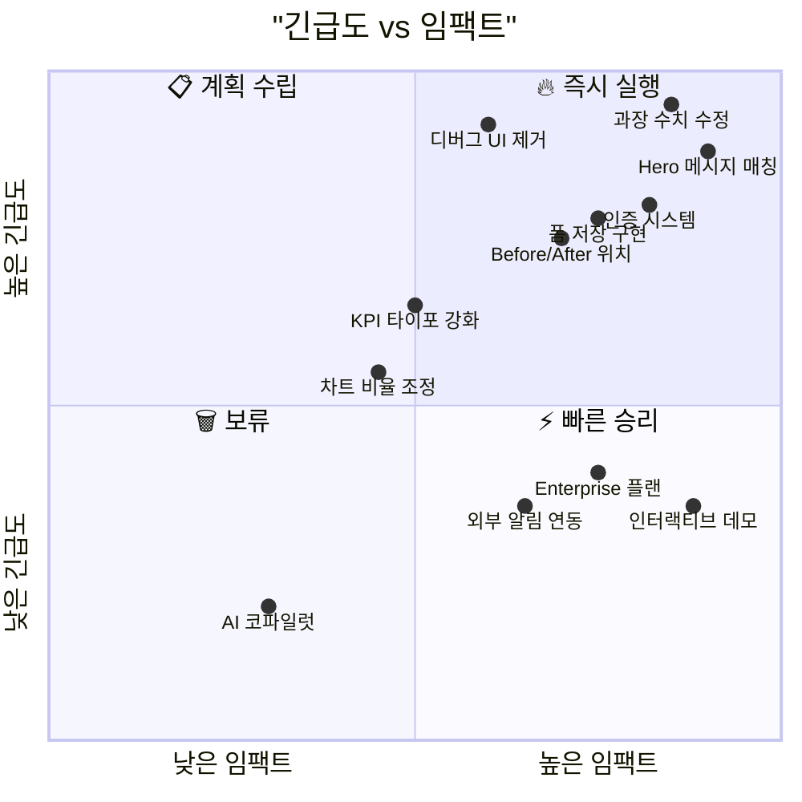

---

> 📝 이 보고서는 localhost:3000에서 실행 중인 Agency OS의 **18개 전체 페이지**(마케팅 4 + 대시보드 13 + 로그인 1)를 직접 브라우징하여 작성되었습니다. 모든 화면 캡처는 실제 렌더링된 스크린샷이며, 분석은 세 전문가의 관점에서 독립적으로 수행된 후 통합되었습니다.
